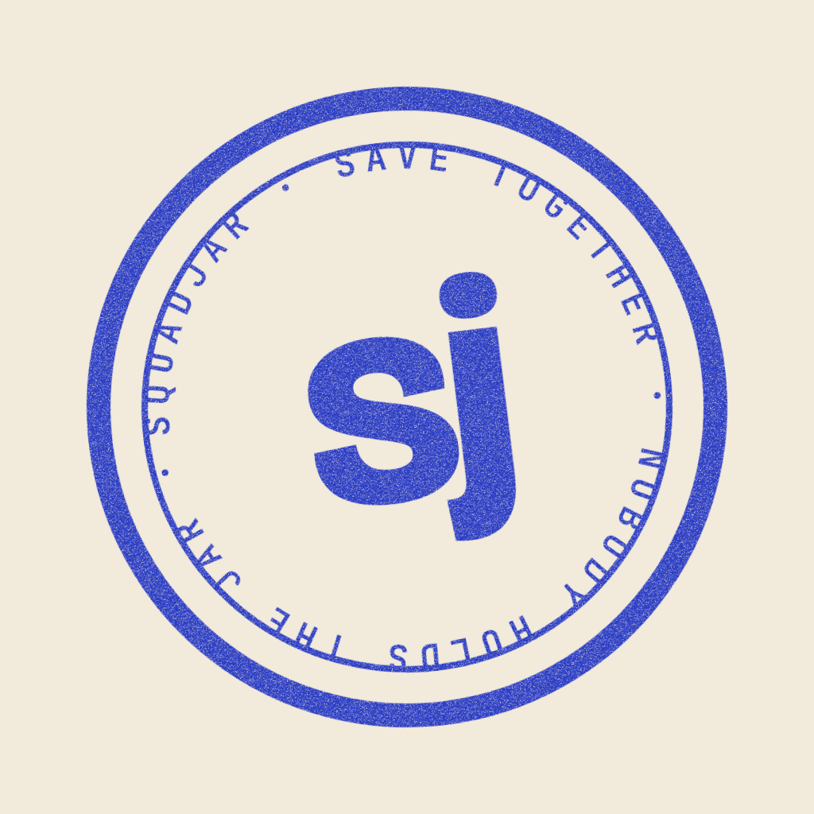
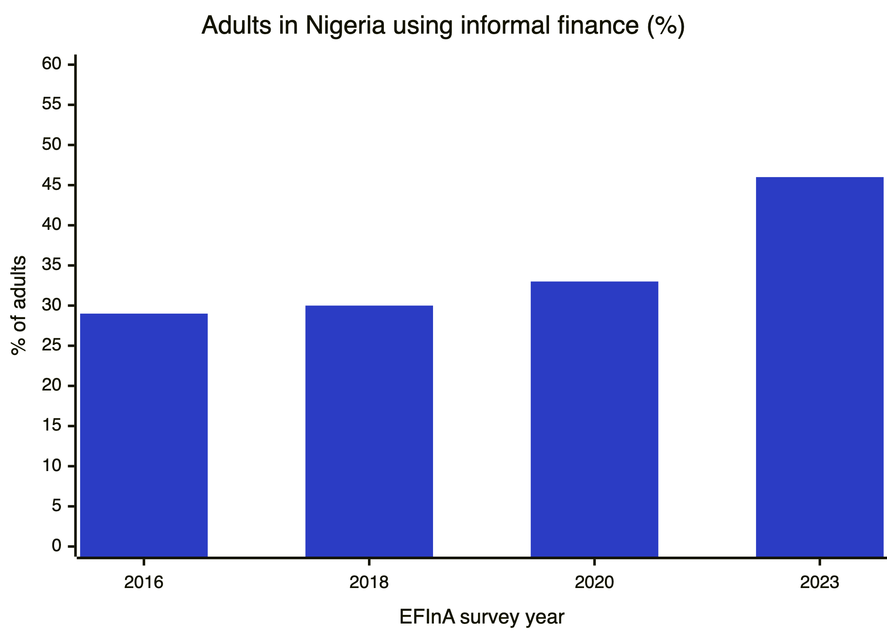
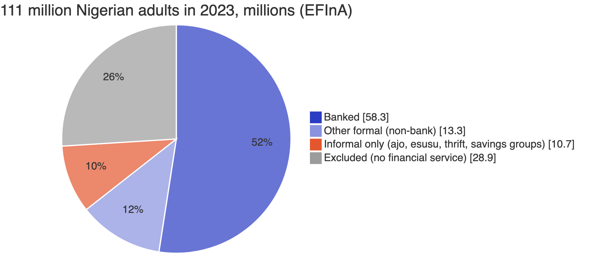
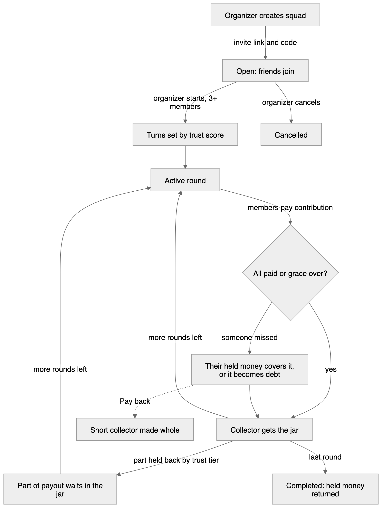
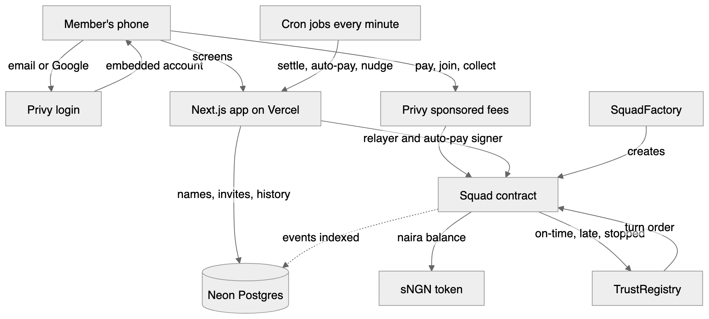

<p align="center"></p>

# Squadjar

Ajo without a treasurer. Your group saves together, each person's payout lands on schedule, and nobody can run off with the money.

- Live app: https://squadjar.vercel.app
- Judges, start here: https://squadjar.vercel.app/try
- Built for Monad Metropolis, Consumer Products & Payments track.

## Contents

1. [What ajo is](#1-what-ajo-is)
2. [How big it is in Nigeria](#2-how-big-it-is-in-nigeria)
3. [The problem](#3-the-problem)
4. [Who Squadjar is for](#4-who-squadjar-is-for)
5. [Why we built it](#5-why-we-built-it)
6. [How Squadjar works](#6-how-squadjar-works)
7. [Try it (judges)](#7-try-it-judges)
8. [Architecture](#8-architecture)
9. [What's onchain](#9-whats-onchain)
10. [Built with](#10-built-with)
11. [Testing](#11-testing)
12. [Run it locally](#12-run-it-locally)
13. [Business model](#13-business-model)
14. [What we'll integrate next](#14-what-well-integrate-next)
15. [Team](#15-team)
16. [References](#16-references)

## 1. What ajo is

Ajo is a rotating savings group. A group agrees on an amount, say ₦5,000 a week. Every week each person pays in, and one person takes the whole pot. The next week it's someone else's turn, until everyone has collected once.

It goes by many names in Nigeria: **ajo** and **esusu** in Yoruba, **isusu** in Igbo, **adashe** (adashi) in Hausa [1][2]. The person who collects and holds the money is the **alajo** [1][3].

It is old. The anthropologist William Bascom wrote about esusu as a Yoruba credit institution in 1952 [4]. The practice is believed to have started among the Yoruba, spread across West Africa, and travelled to the Caribbean, where it is still called **susu** [1]. Researchers have studied rotating savings groups worldwide since Shirley Ardener's 1964 comparative study [5].

People use it because it works without a bank: it's social, it's flexible, and a lump sum arrives on a known date.

## 2. How big it is in Nigeria

EFInA's Access to Financial Services (A2F) survey tracks how Nigerians save and borrow. "Informal finance" in the survey covers savings groups, thrift collectors (alajo), village associations, co-operatives and moneylenders [6].



| Year | Adults using informal finance | Source |
|---|---|---|
| 2016 | 29% | EFInA A2F [6] |
| 2018 | 30% | EFInA A2F [6][7] |
| 2020 | 33% | EFInA A2F [6][7] |
| 2023 | 46% of 111 million adults | EFInA A2F 2023 [6] |

46% of 111 million is about **51 million adults** (our arithmetic on EFInA's figures). EFInA reports informal usage grew 39% between 2020 and 2023 [6].



About 10.7 million adults rely **only** on informal finance, and 28.9 million (26%) use no financial service at all [6][8].

An older World Bank figure points the same way. In 2011, 44% of Nigerian adults, and 69% of those who saved, saved through a savings club or a person outside the family. The paper names esusu, ajo, cha and adashi [9]. This is a different survey, so we don't plot it on the chart above.

## 3. The problem

Ajo runs on trust in one person. The alajo or organizer holds everyone's money, and when that goes wrong there is no recourse.

- **Collectors disappear with the money.** In August 2026 a businesswoman said she lost ₦10 million in ajo savings when the coordinator refused to pay her turn [10]. In July 2026 a woman lost ₦180,000 she had saved at ₦1,000 a day when her collector vanished [11]. A trader told VOA that collectors disappear after taking a month's contributions [3]. Traders told BusinessDay the risk is an alajo you don't know well [12].
- **Members stop paying after they collect.** Whoever collects early has the least reason to keep paying. Researchers note breach of contract is a built-in risk of rotating savings groups, often with no legal recourse [5].
- **Late payments and shifting dates.** A digital-ajo founder told ThisDay that groups mostly fail on coordination: late contributions and payout dates that move [13].
- **Records live on paper or in WhatsApp.** "Who paid?" becomes an argument.

Existing apps don't fix the core issue. Group savings in PiggyVest or Cowrywise is goal saving, not a rotation [14][15]. Apps that digitise ajo itself still have the platform or the collector hold the pot [13][16].

## 4. Who Squadjar is for

Everyone in Nigeria who does ajo. We're starting with three groups:

- **Market sellers and traders.** They use daily contributions to restock goods, and they are the alajo's classic customers [12][17][18].
- **Workers.** Salaried and freelance workers run weekly or monthly ajo with colleagues and friends [18][19].
- **Students.** Class reps, hostel mates and course mates who pool money for fees, rent and gadgets. This is our launch group: one class rep can bring a whole squad. We haven't found a published study on student ajo, so we treat this as our own bet to test.

## 5. Why we built it

Ajo already works. The money and the habit are there; only the treasurer is the weak point. Squadjar keeps everything people like about ajo (friends, a fixed amount, a lump sum on a date) and removes the one person who can run off with it.

Instead of one person holding the pot, the pot sits in a jar that no member can touch. The jar only pays the collector whose turn it is. Every payment is on a shared record, so nobody argues about who paid. And because payment history builds a trust score, being reliable in one squad helps you in the next.

The app has to feel like any normal money app. No new words to learn. It's in English, Pidgin, Yorùbá, Igbo and Hausa, and you log in with email or Google.

## 6. How Squadjar works



- **Squad.** 3 to 20 members. Whoever creates it is the organizer, and loses all special powers once rounds begin.
- **Private by invite.** You join only with the squad's invite link and code, usually shared on WhatsApp. The organizer can remove a member before rounds begin.
- **Jar.** The squad's money. Its own contract holds it, so no member, not even the organizer, can take it out.
- **Rounds.** Each round every member pays the same **contribution**. When everyone has paid, or the grace period ends, the jar pays the whole **payout** to that round's **collector**. A squad of n members runs n rounds, and everyone collects once.
- **Turn order by trust score.** Turns are set when the squad starts. Better payment record collects earlier. Ties are broken at random.
- **No deposit to join.** Rounds begin as soon as the organizer starts the squad. When it's your turn you get your payout. If you're new, part of it waits in the jar until you've paid your share, then it comes back to you.
- **Held money.** When you collect, the jar holds back the rounds you still owe, less an allowance from your tier at start: New holds 100%, Building 75%, Reliable 50%. The last turn holds nothing. Held money covers your own later misses and comes back in full at the end.
- **Debt and pay back.** A miss your held money can't cover becomes debt, and that round's collector is paid that much less for now (their credit). Pay back clears the whole debt at once and the money goes straight to the members who were paid short. If you collect while you still owe, the debt comes out of your payout first. Pay back works after the squad completes too.
- **Alerts.** When a round settles with a miss, the member who missed gets an in-app alert with what to pay back, and the short-paid collector is told why. They're told again when the money comes back.
- **Trust score and tiers.** Built from your payments across every squad: on time adds, late and missed subtract, finishing a squad adds. Tiers are New, Building and Reliable. Only real squads count (5+ members, ₦1,000+ contribution, weekly or monthly). Quick demo squads don't.
- **Auto-pay.** Turn it on and the app pays your contribution when the round opens. The signer it uses can only pay contributions, nothing else.
- **Reminders.** In-app nudges before a payment is due, and a one-tap WhatsApp reminder for the organizer.
- **History.** Every add, payment, payout, held amount, held money back, pay back, send and withdrawal, with dates in Nigeria time.

## 7. Try it (judges)

1. Open https://squadjar.vercel.app and log in with email or Google. A test login is in the submission form.
2. Tap **Add money**. This is a test-mode checkout that credits test naira.
3. Open https://squadjar.vercel.app/try. It takes you to a live demo squad with the invite code filled in. Join it.
4. Two bot members, Ada and Tunde, are already in the squad. Once you join, they start it and pay every round with you.
5. Demo rounds are 5 minutes. A full squad takes about 15 to 20 minutes. You'll see: round 1 starting right away, paying a round, your payout receipt when it's your turn (what you got now and what waits in the jar), the held money coming back at the end, and the history showing who paid.

All money is test money on Monad testnet.

## 8. Architecture



- **Phone.** The app is a Next.js 16 web app that installs to the home screen.
- **Login and accounts.** Privy handles email and Google login and creates an embedded account for each member. Fees are sponsored, so a new user with no MON can do everything.
- **Contracts on Monad.** They hold the money, the membership, the turn order, held money and debt, and the trust record. That's the only source of truth for money.
- **Neon Postgres.** Holds display data only: names and usernames, invite codes, notifications, and an index of past activity for the history screen.
- **Cron jobs.** Every minute: settle rounds whose grace has ended, run auto-pay, send nudges, and keep the judge demo squad going.
- **Relayer.** A server account that only pokes overdue rounds to settle. It never touches member money. If no relayer is set, members' own apps settle the round when they open it.

Diagram sources (`.mmd`, editable `.excalidraw`) are in [docs/diagrams](docs/diagrams).

## 9. What's onchain

Monad testnet, chain 10143. Addresses come from [`contracts/deployments/10143.json`](contracts/deployments/10143.json).

| Contract | What it does | Address |
|---|---|---|
| AjoNGN (sNGN) | Test naira with a capped faucet, used by Add money | [`0xb7A5...10C9`](https://testnet.monadexplorer.com/address/0xb7A57BeF0DD01A96C7626fDD6F143C9127d110C9) |
| TrustRegistry | Keeps every member's payment record and works out trust score and tier | [`0xe80e...3eCB`](https://testnet.monadexplorer.com/address/0xe80e9A23B647CD653F3A5ef16222aD6794C23eCB) |
| SquadFactory | Creates one Squad contract (the jar) per squad and registers it | [`0x7bBA...8Ef2`](https://testnet.monadexplorer.com/address/0x7bBADfC407b7eC8941B7A72A4820Ae946dF48Ef2) |

Each squad is its own contract that holds the jar, runs the rounds and pays out. Every payment, payout, refund and trust update happens onchain. Members never see any of that. Contract details are in [contracts/README.md](contracts/README.md).

## 10. Built with

- **Monad**: holds the jars and the trust record. Fast, cheap blocks make per-round payments practical.
- **Privy**: email and Google login, embedded accounts, sponsored fees, and a policy-limited signer for auto-pay that can only call `contribute()`. Notes: [docs/privy-notes.md](docs/privy-notes.md).
- **Next.js 16**, React 19, Tailwind v4: the app.
- **Neon Postgres**: display data.
- **Vercel**: hosting. cron-job.org runs the every-minute jobs.
- **Foundry**: contract tests and deploys.

## 11. Testing

- **Contracts:** `cd contracts && forge test` runs 74 tests, including 2 invariant tests that check the jar always balances.
- **End to end:** `scripts/e2e/run.sh` runs 11 scenarios against the deployed contracts on a Monad testnet fork: happy path, a round 1 miss turning into debt and being paid back, a collector missing their own round, held money covering later misses, debt taken from a payout, cancelled squads, late settle, trust score and round timing. Every jar ends at ₦0. `scripts/e2e/judge.sh` plays a full demo squad with the bot members. See [scripts/e2e/README.md](scripts/e2e/README.md).
- **App:** `cd app && npx tsc --noEmit && npm run build && npm run check:copy`, plus `node lib/<name>.check.ts` for each logic module.

## 12. Run it locally

You need Node.js. You also need Foundry if you want to run the contract tests.

```bash
cd app
npm install
cp .env.example .env.local
npm run db:migrate
npm run dev -- -p 3100
```

Open http://localhost:3100. With no env vars the app runs on demo data. To go live, fill in `.env.local`:

| Variable | Used for |
|---|---|
| `NEXT_PUBLIC_PRIVY_APP_ID`, `PRIVY_APP_SECRET` | Login and embedded accounts |
| `DATABASE_URL` | Neon Postgres |
| `NEXT_PUBLIC_FACTORY`, `NEXT_PUBLIC_TOKEN` | Contract addresses from section 9 |
| `RELAYER_PRIVATE_KEY`, `CRON_SECRET` | Settling overdue rounds, and protecting the cron routes |
| `PRIVY_AUTH_PRIVATE_KEY`, `NEXT_PUBLIC_PRIVY_SIGNER_ID`, `NEXT_PUBLIC_PRIVY_AUTOPAY_POLICY_ID` | Auto-pay ([docs/privy-notes.md](docs/privy-notes.md)) |
| `JUDGE_BOT_KEYS` | The two demo-squad bot members (server only) |
| `NEXT_PUBLIC_APP_URL` | Base URL for shared links |

Never put a private key in a `NEXT_PUBLIC_` variable. Those are visible to everyone.

## 13. Business model

This is planned for mainnet. None of it is live, and the testnet app charges nothing. Details are in [docs/business-model.md](docs/business-model.md).

- **Payout fee.** A small, capped fee, taken only when someone collects. It replaces the cut a traditional alajo keeps.
- **Yield share.** Money waiting in jars can earn yield on mainnet. Squadjar keeps a share, and member principal is never at risk.
- **Group plans.** Associations, co-operatives and unions running many squads pay a flat plan fee.
- **Credit partners.** With the member's consent, lenders can use the trust record to offer credit to people with no bank history.

## 14. What we'll integrate next

- **Real naira in and out.** Bank transfer deposits and withdrawals through a licensed Nigerian payment partner. Today Add money is test mode.
- **Monad mainnet.**
- **Phone number login.** Many traders don't use email.
- **Daily squads.** Daily contributions for market sellers, matching how an alajo collects.
- **WhatsApp bot.** Pay, check your turn and get reminders inside WhatsApp.
- **Trust record you can carry.** Let members share their record with lenders and co-operatives, only with their consent.
- **Group plans** for co-operatives and associations, with shared reports.

## 15. Team

- **Farouk**, product and app: [faroukobayanju](https://github.com/faroukobayanju)
- **Obaseki Imisioluwa**, contracts and infrastructure: [Haikeysgit](https://github.com/Haikeysgit)

We don't have real-user results yet, and we don't claim any.

## 16. References

1. Global Encyclopaedia of Informality, "Esusu (Nigeria)". https://www.in-formality.com/wiki/index.php?title=Esusu_%28Nigeria%29
2. Oxford English Dictionary, "susu". https://www.oed.com/dictionary/susu_n3
3. VOA, "Nigerians turn to community savings amid financial struggles", 6 Dec 2024. https://www.voanews.com/a/nigerians-turn-to-community-savings-amid-financial-struggles-/7890615.html
4. Bascom, W. R. (1952). "The Esusu: A Credit Institution of the Yoruba". Journal of the Royal Anthropological Institute 82: 63-69. https://ehrafworldcultures.yale.edu/cultures/ff62/documents/017
5. "Rotating savings and credit association" (Ardener 1964; Bouman on breach of contract). https://en.wikipedia.org/wiki/Rotating_savings_and_credit_association
6. EFInA, Access to Financial Services in Nigeria 2023 survey, launch presentation. https://a2f.ng/wp-content/uploads/2023/12/A2F-2023-Event-Day-Presentation-final.pdf
7. EFInA, Access to Financial Services in Nigeria 2020 survey, final report. https://efina.org.ng/wp-content/uploads/2021/10/A2F-2020-Final-Report.pdf
8. EFInA, "Formal financial inclusion in Nigeria soars to 64%". https://a2f.ng/formal-financial-inclusion-in-nigeria-soars-to-64-driven-by-non-banking-channels-report/
9. Demirgüç-Kunt, A. and Klapper, L. (2012). "Measuring Financial Inclusion: The Global Findex Database". World Bank. https://www.fdic.gov/system/files/2024-08/measuring-financial-inclusion-the-global-findex-database.pdf
10. Legit.ng, businesswoman loses ₦10 million ajo savings, 6 Aug 2026. https://www.legit.ng/people/1723654-nigerian-businesswoman-cries-losing-n10-million-ajo-savings-meant-factory/
11. Legit.ng, lady shares experience saving with an ajo collector, Jul 2026. https://www.legit.ng/people/1718360-lady-shares-experience-saving-money-ajo-collector-what-happened-6-months/
12. BusinessDay, "Ajo: old ally retains traders' trust over banks, fintechs", 7 Jul 2021. https://businessday.ng/backpage/article/ajo-old-ally-retains-traders-trust-over-banks-fintechs/
13. ThisDay, "Can WeSpare make digital ajo work in Nigeria's low-trust economy?", 6 Mar 2026. https://www.thisdaylive.com/2026/03/06/can-wespare-make-digital-ajo-work-in-nigerias-low-trust-economy/
14. PiggyVest, Target Group Savings. https://blog.piggyvest.com/save/piggyvest-target-group-savings/
15. Cowrywise, Circles. https://cowrywise.com/blog/cowrywise-circles-group-savings/
16. Nigeria CommunicationsWeek, "Thrifto digitizes Nigeria's ajo, esusu savings". https://www.nigeriacommunicationsweek.com.ng/thrifto-digitizes-nigerias-ajo-esusu-savings-for-safer-group-finance/
17. Nwosu, E. and Mmoh, U. (2016). "Digitization of ESUSU Thrift Savings Scheme in Nigeria". African Journal of Basic & Applied Sciences 8(2): 90-95. https://idosi.org/ajbas/ajbas8(2)16/4.pdf
18. The Conversationalist, "How a traditional microsavings system enabled Nigerian women to save their businesses during the pandemic", 24 Feb 2022. https://conversationalist.org/2022/02/24/how-a-traditional-microsavings-system-enabled-nigerian-women-to-save-their-businesses-during-the-pandemic/
19. Leadership, "Ajo, esusu: how Nigeria's home-grown thrift system continues to power millions outside formal banking". https://leadership.ng/ajo-esusu-how-nigerias-home-grown-thrift-system-continues-to-power-millions-outside-formal-banking/
